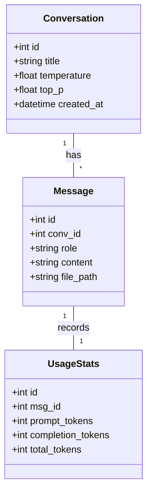
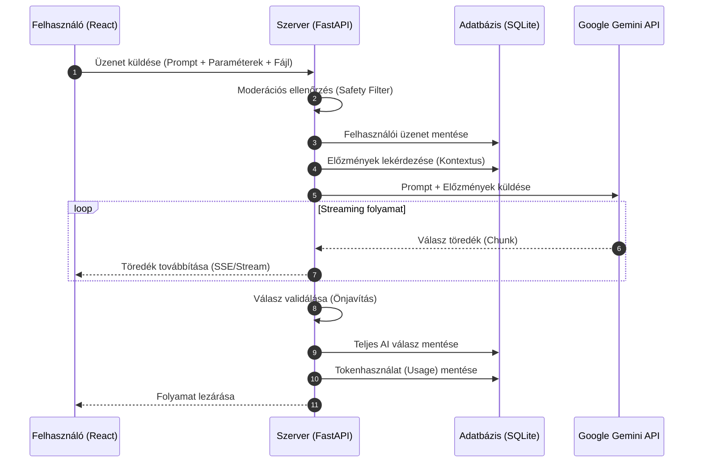

# Nagy Nyelvi Modell Csevegő Alkalmazás - Projektmunka
**Készítette:** Kovács László
**Kurzus:** LLM és GPT modellek architektúrája, működése és alkalmazása a szoftverfejlesztésben
**Oktató:** Sárosi Gábor

## 1. Projekt célkitűzése
A projekt célja egy olyan webes chatalkalmazás létrehozása, amely közvetlen API kapcsolatot létesít nagy nyelvi modellekkel (a feladatban Google Gemini). Az alkalmazás támogatja a modern AI-interakciók alapkövetelményeit, mint a streaming válaszadás és a kontextusfüggő beszélgetés. 

## 2. Alkalmazott technológiák
* **Frontend:** React.js (dinamikus paraméterállítás és streaming megjelenítés).
* **Backend:** Python FastAPI (aszinkron handler-ek és httpx/openai-streaming kliens).
* **Adatbázis:** SQLite (beszélgetések és tokenhasználat perzisztens tárolása).
* **LLM API:** Google Gemini API.

## 3. Rendszerarchitektúra és Működés
Az alkalmazás moduláris felépítésű, az alábbi rétegekre tagolva:
1.  **Kliens oldali réteg:** Kezeli a felhasználói beviteleket, a fájlcsatolást (PDF/Kép) és a hiperparaméterek (Temperature, Top-P) beállítását.
2.  **Szerver oldali réteg:** Aszinkron módon továbbítja a kéréseket az LLM felé, kezeli a korábbi üzenetek előzményeit (kontextus), és méri a tokenfelhasználást.
3.  **LLM réteg:** A modellek feldolgozzák a promptokat, figyelembe véve a részletes System Promptokat és a moderációs szabályokat.
4.  **Adatbázis réteg:** SQLite alapú tárolás a beszélgetésekhez, üzenetekhez és statisztikákhoz. Az adatbázis fájl (chat.db) az első indításkor automatikusan generálódik.
   - > Beszélgetések: Tárolja a beszélgetések egyedi azonosítóját, címét és a létrehozás dátumát.
   - > Üzenetek: Itt kerülnek mentésre a felhasználói promptok és az LLM válaszok, biztosítva a kontextuskezelést (a korábbi üzenetek visszatöltését az LLM számára).
   - > Tokenhasználat: Minden API hívás után elmentjük a prompt_tokens, completion_tokens és total_tokens értékeket az adott beszélgetéshez rendelve.
5.  **Komponensek elkülönítése:** A különböző modulok külön fájlokba, osztályokba, könyvtárakba vannak szervezve.

### 3.1. Prompt Engineering és Biztonság

Az alkalmazás dedikált rendszerüzeneteket (System Prompt) használ a modell viselkedésének szabályozására és a válaszok minőségének biztosítására.

#### Részletes System Prompt
A központi System Prompt az alábbi struktúrát követi a hatékony interakció érdekében:
Szerepkör meghatározása: "Te egy professzionális, segítőkész AI asszisztens vagy, aki szoftverfejlesztési és általános kérdésekben nyújt támogatást." 
Formátumra vonatkozó instrukciók: "A válaszaidat minden esetben Markdown formátumban add meg. A kódrészleteket szintaxiskiemeléssel (code block) lásd el." 
Nyelvi korlátok: "Alapértelmezés szerint magyar nyelven válaszolj, kivéve, ha a felhasználó más nyelven kérdez."
Stílus: "Legyél tömör, de lényegre törő. Kerüld a felesleges udvariassági köröket, fókuszálj a technikai pontosságra."

#### LLM-alapú Moderáció
A biztonsági követelményeknek megfelelően minden felhasználói bemenet egy előzetes moderációs szűrőn megy keresztül:
Cél: A "Prompt Injection" támadások és a nem megfelelő tartalom kiszűrése válaszgenerálás előtt.
Működés: Egy különálló, kisméretű LLM hívás elemzi a promptot. Ha az károsnak minősül, a rendszer megtagadja a válaszadást.

#### Önjavító mechanizmus
A minőségellenőrzés érdekében a generált válaszokat a háttérben egy kontroll-hívás ellenőrzi:
Relevancia vizsgálat: Egy második LLM hívás veti össze a választ az eredeti kérdéssel.
Korrekció: Amennyiben a válasz irreleváns vagy hibás formátumú, a rendszer automatikusan újragenerálja azt a hiba megjelölésével.

## 4. Adatmodell és Tervezés
* **Beszélgetések:** Tárolja a beszélgetések egyedi azonosítóját, címét és dátumát.
* **Üzenetek:** Mentésre kerülnek a felhasználói promptok és az LLM válaszok a kontextuskezeléshez.
* **Token mérés:** Minden hívás után mentjük a `prompt_tokens` és `completion_tokens` értékeket.

Az alkalmazás az adatokat három fő táblában tárolja az összefüggések biztosítása érdekében:

### 4.1. Conversations (Beszélgetések)
Ez a tábla fogja össze az összetartozó üzeneteket.
| Oszlop neve | Típus | Leírás |
| :--- | :--- | :--- |
| `id` | INTEGER (PK) | Egyedi azonosító |
| `title` | TEXT | A beszélgetés címe (pl. az első kérdés eleje) |
| temperature | FLOAT | A modell kreativitásának beállítása |
| top_p | FLOAT | A válogatási valószínűség beállítása |
| `created_at` | DATETIME | A beszélgetés indításának időpontja |

### 4.2. Messages (Üzenetek)
Itt tároljuk a teljes chat-folyamot a kontextuskezeléshez.
| Oszlop neve | Típus | Leírás |
| :--- | :--- | :--- |
| `id` | INTEGER (PK) | Egyedi azonosító |
| `conv_id` | INTEGER (FK) | Hivatkozás a beszélgetésre |
| `role` | TEXT | 'user' (felhasználó) vagy 'assistant' (AI) |
| `content` | TEXT | Az üzenet szöveges tartalma |
| `file_path` | TEXT | Opcionális: a csatolt kép/PDF elérési útja |

### 4.3. UsageStats (Tokenhasználat)
Ebben a táblában naplózzuk a költségeket/használatot.
| Oszlop neve | Típus | Leírás |
| :--- | :--- | :--- |
| `id` | INTEGER (PK) | Egyedi azonosító |
| `msg_id` | INTEGER (FK) | Melyik válaszhoz tartozik a mérés |
| `prompt_tokens` | INTEGER | A bemeneti tokenek száma |
| `completion_tokens`| INTEGER | A generált válasz tokenjei |
| `total_tokens` | INTEGER | Összesített felhasználás |

Kapcsolati logika:
Az id mezők mindenhol elsődleges kulcsok (PK).
A Messages.conv_id külső kulcsként (FK) kapcsolódik a Conversations.id-hoz (egy beszélgetésnek több üzenete van).
Az UsageStats.msg_id külső kulcsként (FK) kapcsolódik a Messages.id-hoz (minden AI válaszhoz tartozik egy mérés).

### 4.4. UML Osztálydiagram
Az alábbi diagram szemlélteti az adatbázis-struktúrát és a táblák közötti kapcsolatokat:


### 4.5. UML Szekvenciadiagram (Üzenetküldési folyamat)
Az alábbi ábra az üzenetküldés és a válaszgenerálás folyamatát mutatja be az aszinkron streaming és az adatbázis-mentés figyelembevételével:



## 5. Megvalósított funkciók listája
* [x] Üzenetküldés és fogadás: Alapfeltétel a kommunikációhoz.
* [x] Aszinkron hívások: A háttérfolyamatok nem blokkolják az alkalmazást.
* [x] Streaming válaszgenerálás: A szöveg folyamatosan, gépelés-szerűen jelenik meg (Server-Sent Events - SSE technológiával).
* [x] Kontextuskezelés: A modell rálát az előző üzenetekre és válaszokra.
* [x] Dinamikus hiperparaméterek: Temperature, Top-P és egyéb értékek állíthatósága a UI-on.
* [x] Tokenhasználat naplózása: Minden hívás után mentésre kerül az elhasznált mennyiség.
* [x] Korábbi beszélgetések kezelése: Mentés, betöltés és megnyitás funkciók.
* [x] Multimodális bevitel: Kép vagy PDF fájl csatolásának lehetősége.
* [x] Biztonság (Moderáció): Prompt injection elleni védelem LLM segítséggel.
* [x] Minőségellenőrzés (Önjavítás): Válaszok relevanciájának gépi ellenőrzése.

## 6. Fájlstruktúra
```text
/llm-chat-projekt
│
├── /backend               # Python FastAPI kód
│   ├── main.py            # API végpontok, Gemini hívás, Streaming
│   ├── database.py        # SQLite modellek és kapcsolat
│   ├── schemas.py         # Pydantic modellek az adatokhoz
│   ├── reqiurements.txt   # Függőségek telepítéséhez 
│   └── .env               # Itt tárolom a GOOGLE_API_KEY-t
│
│
├── /frontend              # React (Vite) kód
│   ├── /src
│   │   ├── components     # ChatWindow, Sidebar, Settings bar
│   │   └── App.jsx
│
├── README.md              # Ez a fájl, amit most véglegesítettünk
└── .gitignore             # Hogy a .env és a chat.db ne kerüljön fel a GitHubra
```
## 7. Telepítés és futtatás
1. Klónozd a repository-t.
2. Hozz létre egy `.env` fájlt a `/backend` mappában a `GOOGLE_API_KEY` kulcsoddal.
3. Alkalmazás indítása: run_app.py fájl futtatásával elindul a frontend és a backend.
4. Használat: A jobb oldali beállítópanelen a Temperature csúszkával állítható a modell válaszainak változatossága (0.0: precíz, 1.0+: kreatív),
míg a Top-P a valószínűségi mintavételezést szabályozza.

### 7.1 Frontend telepítése
1. Lépj be a frontend mappába: `cd frontend`
2. Telepítsd a függőségeket: `npm install axios lucide-react`
3. Indítás: `npm start`
